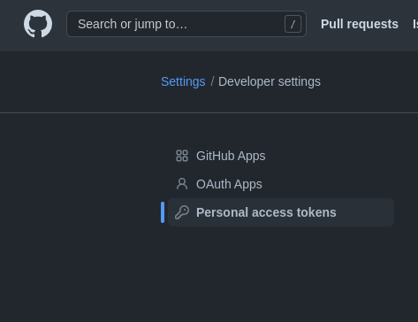
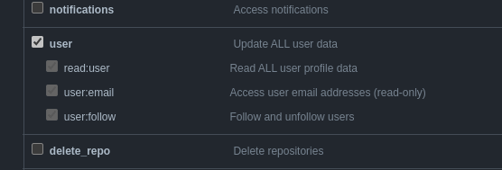

# indonesian_jokes
Kumpulan Jokes berbahasa Indonesia
Project ini dibuat untuk memeriahkan hacktoberfest2021


## Prasyarat
Sehubungan update kebijakan dari github, yakni rest api harus menggunakan `github token`. Maka dari itu anda perlu membuat token dengan mengikuti langkah berikut ini:

- Buka `Personal access tokens` dengan klik tautan ini. [Personal access tokens](https://github.com/settings/tokens) lalu klik button `Generate new token`.

 Developer Settings -> Personal access token" />

- Untuk bagian `Select scopes`, cukup centang `user`. Setelah itu anda `Generate token`.



- Copy token yang sudah anda buat
- Buka project anda lalu buat file baru `.env`
```
touch .env
```
- Terakhir tambahkan `GITHUB_TOKEN` beserta paste token yang telah anda copy ke dalam `.env`.

> Referensi: [Getting started using cURL](https://docs.github.com/en/rest/quickstart#getting-started-using-curl)

## Cara running di local
```
git clone https://github.com/babaiyu/indonesian_jokes.git
cd indonesian_jokes
npm install
```
> Note: Pastikan anda sudah mengikuti panduan [Prasyarat](#prasyarat) sebelum lanjut ke langkah selanjutnya.
```
npm run generate
npm run dev
```

## CONTRIBUTES
Untuk ikut berkontribusi, ikuti langkah-langkah yang mengacu ke [CONTRIBUTING.md](./CONTRIBUTING.md)

_#happy_hacktoberfest_

## CONTRIBUTORS

