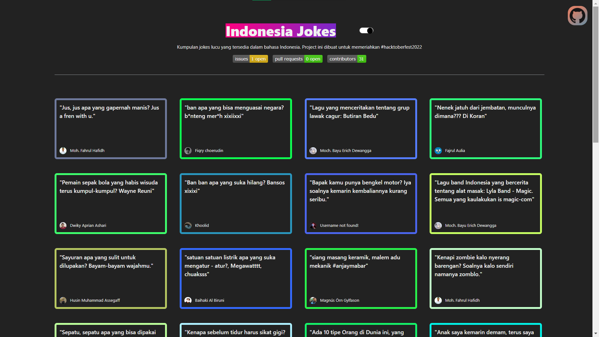

# indonesian_jokes



Kumpulan Jokes berbahasa Indonesia
Project ini dibuat untuk memeriahkan __Hacktoberfest2022__


## Cara running di local

### Download dan instal nvm

Berdasarkan [dokumentasi npm](https://docs.npmjs.com/downloading-and-installing-node-js-and-npm), sangat direkomendasikan untuk menggunakan sebuah __Node version manager__ seperti __nvm__ untuk menginstall npm. Tidak menganjurkan menggunakan Node installer, karena proses instalasi Node melakukan penginstalan npm di direktori dengan _local permissions_ dan dapat menyebabkan _permissions errors_ ketika menjalankan npm secara global.

Disini kita akan menginstall versi __Linux Node version managers__, selain itu dapat melihat panduan [berikut](https://docs.npmjs.com/downloading-and-installing-node-js-and-npm).

1. Buka terminal atau WSL
1. Instal menggunakan salah satu kode cURL atau wget berikut
    ```sh
    curl -o- https://raw.githubusercontent.com/nvm-sh/nvm/v0.39.1/install.sh | bash
    ```
    ```sh
    wget -qO- https://raw.githubusercontent.com/nvm-sh/nvm/v0.39.1/install.sh | bash
    ```
1. Jika tidak masalah, lakukan verifikasi instalasi
    ```sh
    command -v nvm
    ```
    akan menghasilkan `nvm` jika berhasil.
    
    __Catatan__: Pada Linux, jika setelah menjalankan script diatas, kita mendapatkan `nvm: command not found` atau melihat tidak ada umpan balik dari terminal setelah mengetik `command -v nvm`, tutup terminal saat ini dan buka terminal baru dan verifikasi ulang.
1. Download, compile dan instal rilis terbaru dari node
    ```sh
    nvm install node # "node" is an alias for the latest version
    ```
1. Jalankan
    ```sh
    nvm use node
    ```

> Referensi: [nvm-sh/nvm](https://github.com/nvm-sh/nvm)

### Clone repository

- Pada terminal atau WSL yang sama jalankan
    ```sh
    git clone https://github.com/babaiyu/indonesian_jokes.git
    cd indonesian_jokes
    ```

### GitHub Token

Sehubungan update kebijakan dari github, yakni rest api harus menggunakan `github token`. Maka dari itu anda perlu membuat token dengan mengikuti langkah berikut ini:

1. Buka `Personal access tokens` dengan klik tautan ini. [Personal access tokens](https://github.com/settings/tokens) lalu klik button `Generate new token`.

     Developer Settings -> Personal access token" />

1. Untuk bagian `Note`, isi dengan
    ```
    indonesian_jokes
    ```

1. Untuk bagian `Select scopes`, cukup centang `user`. Setelah itu anda `Generate token`.

    

1. Copy token yang sudah anda buat [__Ingat! Ini hanya sekali dan cepat kadaluarsa__]
1. Buat file baru `.env` pada terminal
    ```sh
    touch .env
    ```
1. Terakhir, pada file `.env` masukkan variabel `GITHUB_TOKEN` dengan token yang telah anda copy.
    ```sh
    GITHUB_TOKEN = <ganti_dengan_token_yang_dicopy_tanpa_kurung_atau_tanda_petik>
    ```

> Referensi: [Getting started using cURL](https://docs.github.com/en/rest/quickstart#getting-started-using-curl)

### Running web app

> Note: Pastikan anda sudah mengikuti panduan [GitHub Token](#github-token) sebelum lanjut ke langkah selanjutnya.

- Pada terminal atau WSL yang sama jalankan
    ```sh
    npm install
    npm run generate
    npm run dev
    ```

## CONTRIBUTE
Untuk ikut berkontribusi atau menyumbang jokes, ikuti langkah-langkah yang mengacu ke [CONTRIBUTING.md](./CONTRIBUTING.md)

__#happy_hacktoberfest__

## CONTRIBUTORS

